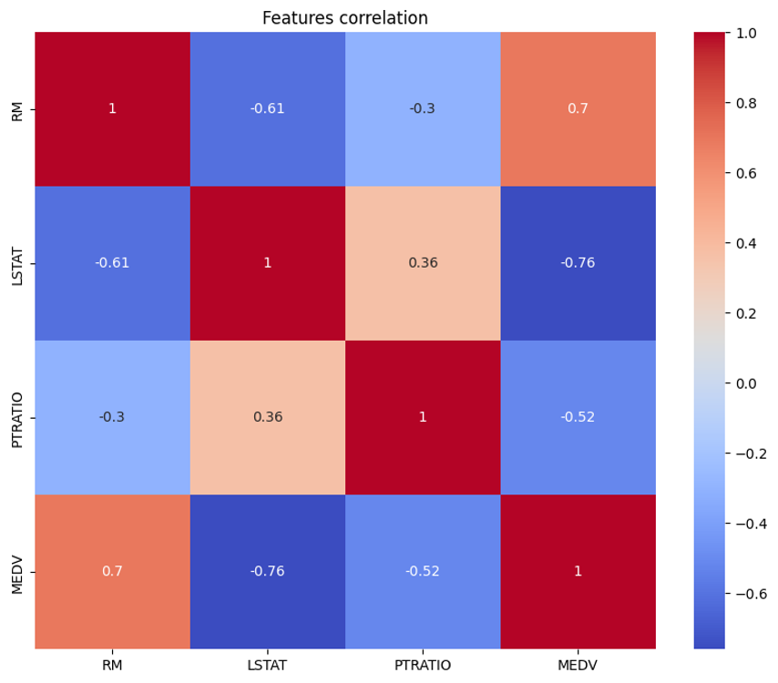
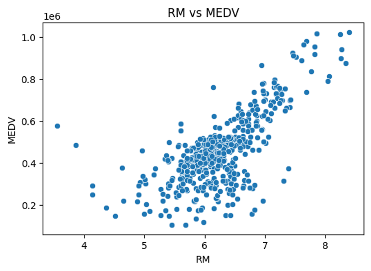
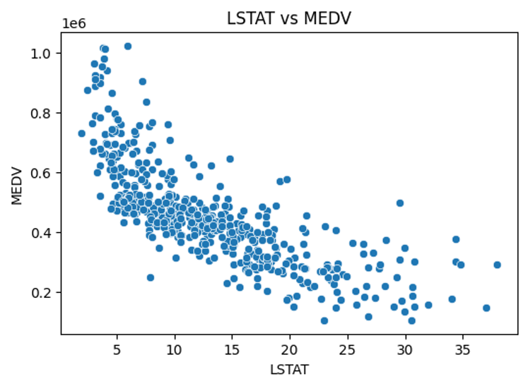
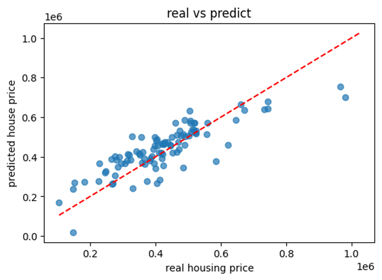
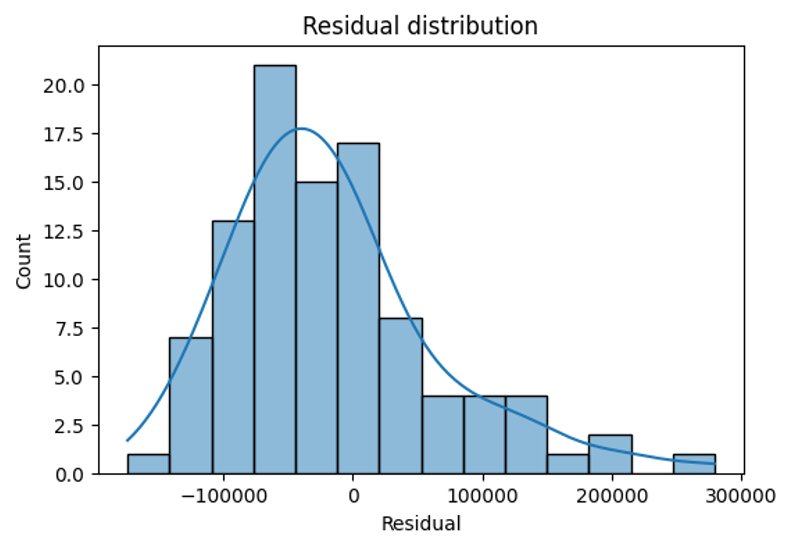
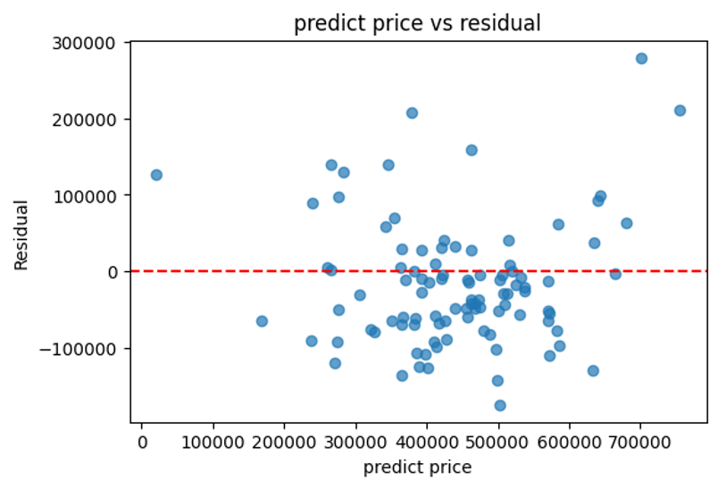
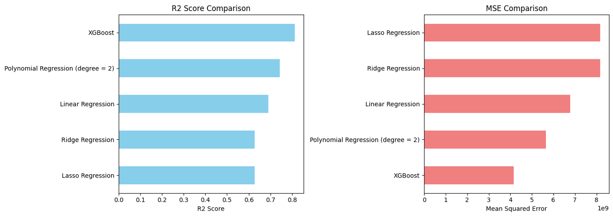

# 🏠 Boston Housing Price Prediction

This project applies **Linear Regression** to predict housing prices based on socioeconomic and structural features from the Boston housing dataset downloaded from Kaggle.

## 📊 Dataset

- Source: Kaggle (housing.csv)
- Rows: ~500 samples
- Features: 13 attributes (e.g., RM, LSTAT, PTRATIO, CRIM)
- Target: MEDV — Median value of homes (in $1000s)

## 🔍 Exploratory Data Analysis (EDA)

- Heatmap of correlation among features and target:
  
  

- Scatterplots of key relationships:
  
  **RM vs MEDV (Rooms vs House Price)**  
  
  
  **LSTAT vs MEDV (Lower-income % vs Price)**  
  

## 📈 Linear Regression Modeling

- Standardized the input features
- Train-test split (80/20)
- Trained `sklearn.linear_model.LinearRegression`
- Evaluated with R² and MSE

**True vs Predicted Price Plot**  

**Residual Distribution**  

**Predicted vs Residuals**  

## 📊 Model Performance Comparison

The following chart compares the R² and MSE scores across all six models:

## 🔁 Cross Validation

- Performed 5-fold cross-validation using R² as the metric

## 🔄 Ridge Regression Comparison

- Trained a Ridge regression model
- Compared performance with baseline Linear Regression

## 💡 Key Takeaways

- **RM** (avg. rooms per house) and **LSTAT** (% low-income residents) are highly predictive
- Linear regression achieved reasonable performance (R² around 0.7–0.8)
- Residual plots show some non-linearity and heteroscedasticity

## 📌 Future Work

- Add Lasso Regression for feature selection
- Use polynomial regression to capture non-linearity
- Try XGBoost or RandomForest for model improvement

---

🧑‍💻 Author: Yiteng Tang  
🎓 OMSCS Student | Nanomaterials Researcher | Data Science Enthusiast  

