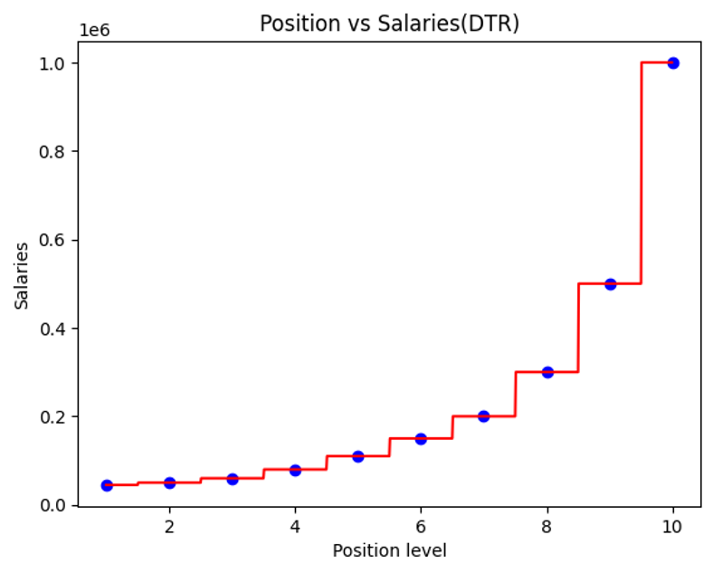
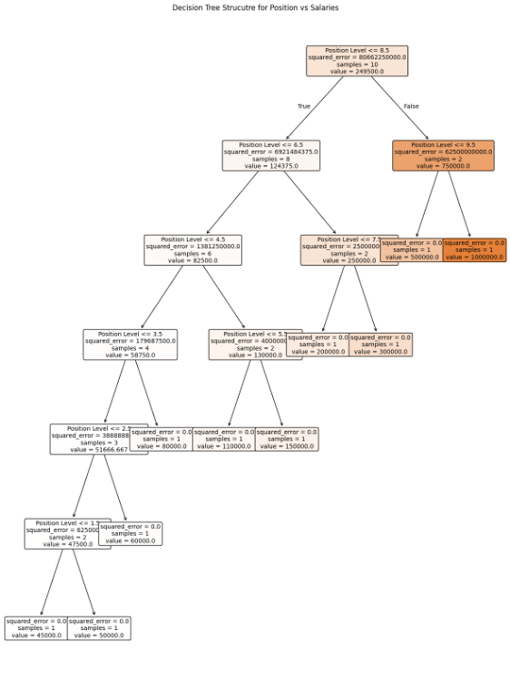

# Decision Tree Regression - Position Salaries Prediction

## 📌 Project Overview

This project demonstrates the use of **Decision Tree Regression** to predict salaries based on position levels.  
The model captures non-linear relationships by partitioning the data into discrete intervals, fitting simple models within each interval.

- 📈 Built a Decision Tree Regressor using scikit-learn.
- 🔥 Visualized both prediction results and the internal structure of the decision tree.
- 🛠️ Technologies: Python, Scikit-Learn, Pandas, Matplotlib, NumPy.

---

## 🎯 Key Contributions

- Implemented a Decision Tree Regression model to model non-linear salary trends.
- Generated a high-resolution input grid to create a smoother, more interpretable prediction curve.
- Visualized model predictions versus actual data points.
- Used `plot_tree()` to graphically display the internal structure and splits of the trained decision tree.
- Enhanced visualization readability with tree node annotations (e.g., split criteria, predicted salary values).

---

## 🛠️ Technologies Used

- **Python 3.x**
- **Scikit-learn** (`DecisionTreeRegressor`, `plot_tree`)
- **Pandas**
- **NumPy**
- **Matplotlib**

---

## 🗂️ Project Structure

---

## 🔥 Workflow

1. **Data Loading**  
   Loaded the `Position_Salaries.csv` dataset and separated features (position level) and targets (salary).

2. **Model Training**  
   Trained a `DecisionTreeRegressor` on the data without requiring feature scaling.

3. **High-Resolution Prediction**  
   Created a finely spaced input feature grid (`X_grid`) to visualize the staircase-like prediction behavior of the decision tree model.

4. **Visualization**  
   - Scatter plot: Actual salary data points.
   - Line plot: Predicted salary curve (stepwise due to the nature of decision trees).
   - Tree diagram: Internal structure showing splits, predicted values, and sample counts.

5. **Interpretation**  
   - Observed how Decision Tree Regression models discrete jumps rather than continuous curves.
   - Gained insights into overfitting/underfitting risks with tree depth.

---

## 📊 Visualization Example

### Regression Result

  

- 🔵 Real salary data points
- 🔴 Predicted salaries (step function)

### Decision Tree Structure

  

- Each node displays:
  - Split condition
  - Predicted salary value
  - Number of samples

---

## 💡 Why Decision Tree Regression?

- **Non-linear Modeling**: Handles non-linear salary trends effectively without manual feature engineering.
- **Interpretability**: Model decisions are highly interpretable through tree visualization.
- **No Feature Scaling Required**: Decision trees are invariant to monotonic transformations.

---

## 🚀 Future Enhancements

- Tune hyperparameters such as `max_depth`, `min_samples_split`, and `min_samples_leaf` to control model complexity and avoid overfitting.
- Apply `RandomForestRegressor` to ensemble multiple trees for better generalization.
- Test on larger and noisier real-world datasets to evaluate performance.

---

## 📚 References

- [Scikit-learn Documentation - DecisionTreeRegressor](https://scikit-learn.org/stable/modules/generated/sklearn.tree.DecisionTreeRegressor.html)
- [Scikit-learn Documentation - plot_tree](https://scikit-learn.org/stable/modules/generated/sklearn.tree.plot_tree.html)

*Part of my Machine Learning Portfolio demonstrating regression modeling and decision tree interpretability.*

