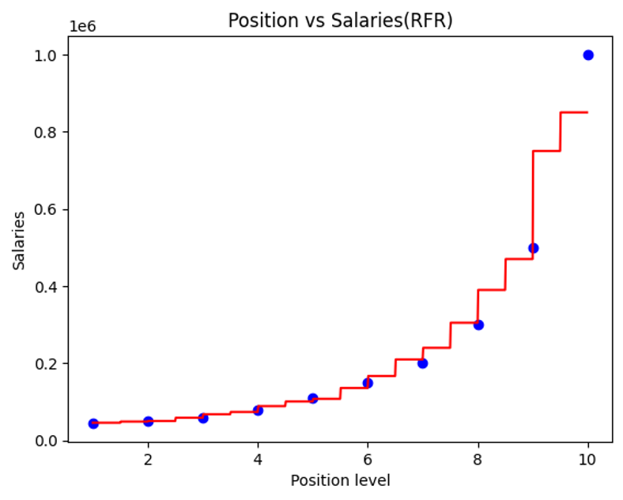

# Random Forest Regression - Position Salaries Prediction

## 📌 Project Overview

This project demonstrates the application of **Random Forest Regression** to predict salaries based on position levels.  
The model combines multiple decision trees to capture complex, non-linear relationships between position and salary.

- 📈 Trained a Random Forest model on salary data.
- 🔥 Visualized both the real data points and the model's stepwise prediction.
- 🛠️ Technologies used: Python, Scikit-Learn, Pandas, Matplotlib, NumPy.

---

## 🎯 Key Contributions

- Implemented a **Random Forest Regression** pipeline from data preprocessing to model training and visualization.
- Predicted salary for unseen data points (e.g., position level 6.5).
- Visualized:
  - Real salary data points (scatter plot)
  - Predicted salary curve (using a high-resolution input grid for smoothness)

---

## 🛠️ Technologies Used

- **Python 3.x**
- **Scikit-learn** (`RandomForestRegressor`)
- **Pandas**
- **NumPy**
- **Matplotlib**

---

## 🗂️ Project Structure

---

## 🔥 Workflow

1. **Import Libraries**  
   Standard libraries for machine learning and visualization.

2. **Load Data**  
   Read position level and corresponding salary data from CSV.

3. **Model Training**  
   Train a `RandomForestRegressor` model with 10 decision trees (`n_estimators=10`).

4. **Prediction**  
   Predict salary for a new position level (e.g., 6.5).

5. **Visualization**  
   - Scatter plot of real salary data.
   - Plot of the Random Forest regression prediction.
   - Smoothed prediction curve by generating a high-resolution input grid.

---

## 📊 Visualization Example

### Regression Result

  

- 🔵 Blue dots: Real salary data points
- 🔴 Red curve: Predicted salaries (stepwise behavior due to ensemble of decision trees)

---

## 💡 Why Random Forest Regression?

- **Non-linear Modeling**: Captures complex patterns without heavy manual feature engineering.
- **Ensemble Method**: Reduces overfitting compared to a single decision tree.
- **Smooth Predictions**: Averaging multiple trees leads to smoother and more generalizable predictions.

---

## 🚀 Future Enhancements

- Increase the number of trees (`n_estimators`) to improve model stability and smoothness.
- Tune hyperparameters (`max_depth`, `min_samples_split`, etc.) to further optimize performance.
- Compare Random Forest Regression with other models such as SVR or Polynomial Regression.
- Apply on larger datasets to assess scalability and robustness.

---

## 📚 References

- [Scikit-learn Documentation - RandomForestRegressor](https://scikit-learn.org/stable/modules/generated/sklearn.ensemble.RandomForestRegressor.html)

---

*Part of my Machine Learning Portfolio demonstrating ensemble regression modeling and visualization skills.*

