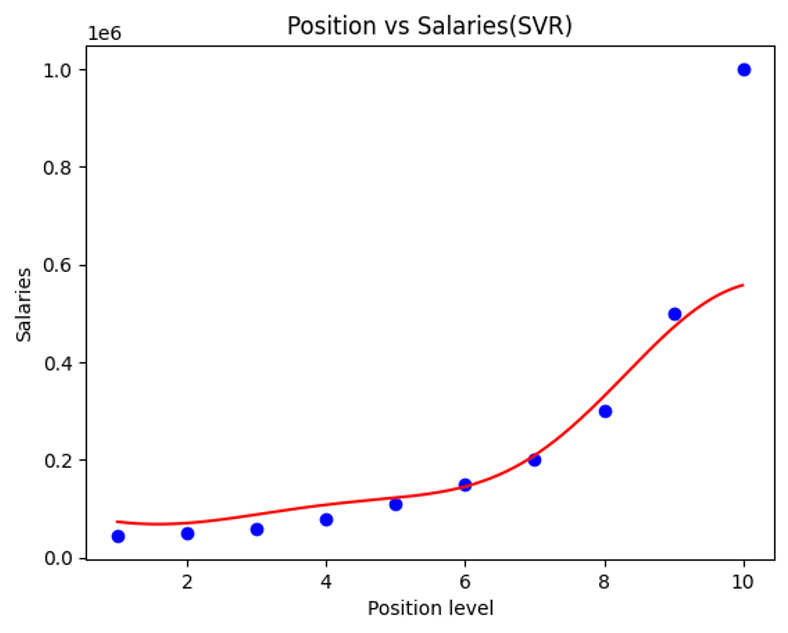

# Support Vector Regression (SVR) - Position Salaries Prediction

## 📌 Project Overview

This project demonstrates the application of **Support Vector Regression (SVR)** to predict salaries based on position levels.  
It highlights key skills in **machine learning model development**, **feature scaling**, **hyperparameter understanding**, and **result interpretation**.

- 📈 Predicts non-linear salary trends based on position level.
- 🔥 Visualizes model predictions with epsilon-tube for tolerated error margins.
- 🛠️ Built with Python, Scikit-Learn, Pandas, Matplotlib, and NumPy.

---

## 🎯 Key Contributions

- Implemented end-to-end regression pipeline, including data preprocessing, feature scaling, and model training.
- Applied **SVR with RBF kernel** to capture complex non-linear relationships.
- Visualized results with:
  - Actual data points
  - Predicted salary curve
  - Epsilon-tube for error margin interpretation
- Conducted inverse-scaling for model interpretability in real-world salary units.

---

## 🛠️ Technologies Used

- **Python 3.x**
- **Scikit-learn** (`SVR`, `StandardScaler`)
- **Pandas**, **NumPy**
- **Matplotlib** for data visualization

---

## 🗂️ Project Structure

---

## 📊 Visualization Example

  

- **Blue dots**: Real salary data points
- **Red curve**: SVR model prediction
- **Light blue area**: Epsilon-tube (tolerated error)

---

## 💡 Why SVR?

- Traditional Linear Regression cannot handle non-linear salary trends.
- SVR with an RBF kernel models complex patterns while avoiding overfitting.
- The epsilon-tube offers a practical margin for acceptable prediction errors.

---

## 🚀 Future Improvements

- Tune hyperparameters (`C`, `epsilon`, `gamma`) using Grid Search.
- Compare performance with Decision Tree and Random Forest Regressors.
- Apply the methodology to real-world datasets with higher variance.

---

## 📚 Learnings and Takeaways

- **Mastered preprocessing** for SVR (feature scaling is crucial).
- **Deepened understanding** of epsilon-insensitive loss functions.
- **Gained experience** in visualizing machine learning results for intuitive model evaluation.

*Part of my Machine Learning portfolio demonstrating regression modeling and model visualization skills.*

